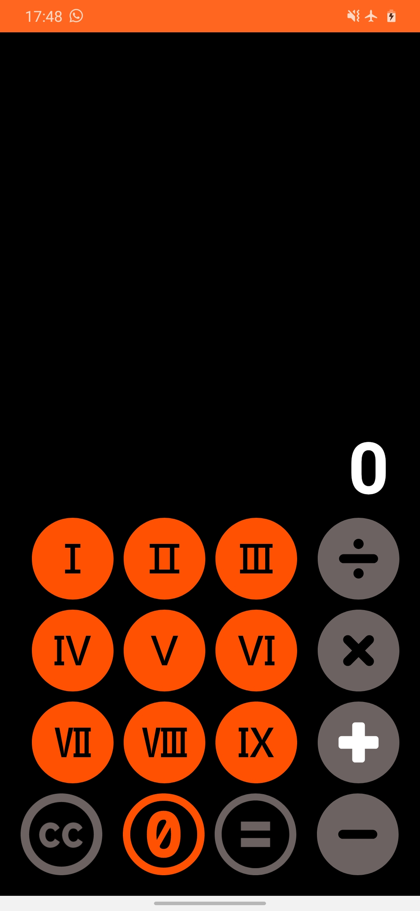

# Calculator App

## Description
The Calculator App is a simple Android application that allows users to perform basic mathematical calculations on their mobile devices. It provides a user-friendly interface with essential arithmetic operations like addition, subtraction, multiplication, and division.

## Features
- Addition: Perform addition of two or more numbers.
- Subtraction: Perform subtraction of one number from another.
- Multiplication: Perform multiplication of two or more numbers.
- Division: Perform division of one number by another.
- Clear: Clear the current input and start a new calculation.
- Decimal Point: Enter decimal numbers for precise calculations.

## Screenshots
<table>
  <tr>
    <td></td>
    <td></td>
  </tr>
</table>

## Technologies Used
- Java: Programming language used for Android app development.
- Android Studio: Integrated Development Environment (IDE) for Android app development.
- XML: Used for designing the user interface.

## Installation
1. Clone the repository to your local machine using `git clone https://github.com/KKBhati07/Calculator.git`.
2. Open the project in Android Studio.
3. Build the project and run it on an Android emulator or physical device.

